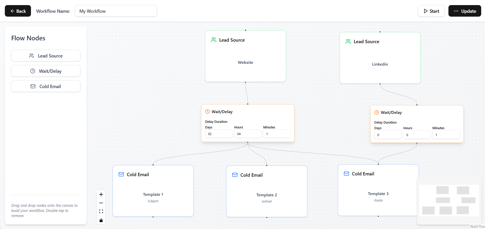

# Email Sequence Flows Automation Frontend

Backend Repository: 
https://github.com/vivekbopaliya/email-sequence-backend





## What is Email Sequence?
Email Sequence helps you send emails automatically. You can add lead sources and create cold email campaigns. Build custom workflows by adding your list of contacts, setting delays between emails, and creating email content. Once you start the workflow, all emails will be sent automatically based on your settings.


## Features
- Send emails automatically without manual work
- Add multiple groups of email contacts
- Set time gaps between emails
- Start or pause email campaigns whenever you want
- Make changes to existing workflows
- Remove workflows you don't need anymore (this also stops any scheduled emails)

## How to Set Up?

### Before You Start
- Make sure you have [Bun](https://bun.sh/) installed on your computer
- You'll need to set up the backend server from [this link](https://github.com/vivekbopaliya/email-sequence-backend)

### Setting Up the Frontend
```bash
# Install all needed files
bun install

# Start the program
bun dev
```
### Important Things to Remember

- Both the frontend (website) and backend (server) need to be running simultaneously for the application to work properly.

- Complete all backend setup steps correctly, including environment variables and database connection.

- For a complete understanding of the application architecture and workflow, thoroughly read the [README file](https://github.com/vivekbopaliya/email-sequence-backend/blob/main/README.md) in the backend repository

## How to Use?

### Getting Started
1. Go to the auth page and create a new account with your email and password
2. Sign in with your new account

### Creating Workflows
- From your dashboard, click "Create new workflow" to open the canvas
- Add different parts to your workflow by dragging and dropping:
  - **Lead Source Node** (required): This is where you add the emails of people you want to contact
  - **Delay Node** (optional): This adds waiting time between emails
  - **Email Node**: This is where you write the actual email content
- You can save your workflow for later or save and start it right away
- You can start or stop your workflows anytime
- You can update your workflows whenever you need to
- If you delete a workflow, it will stop sending any emails that were part of that workflow
